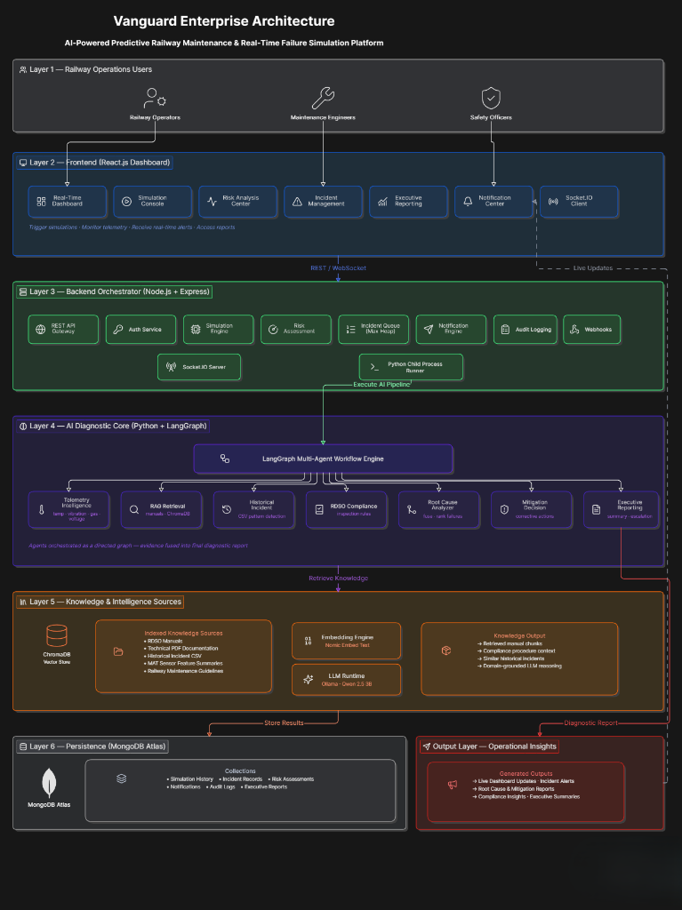
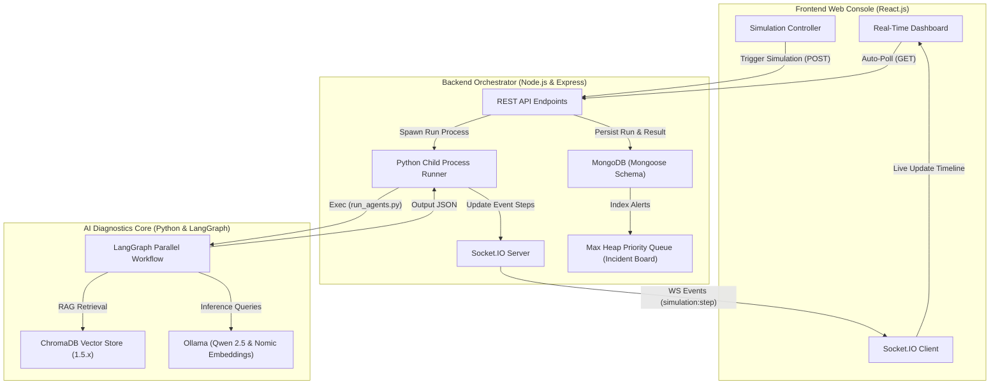
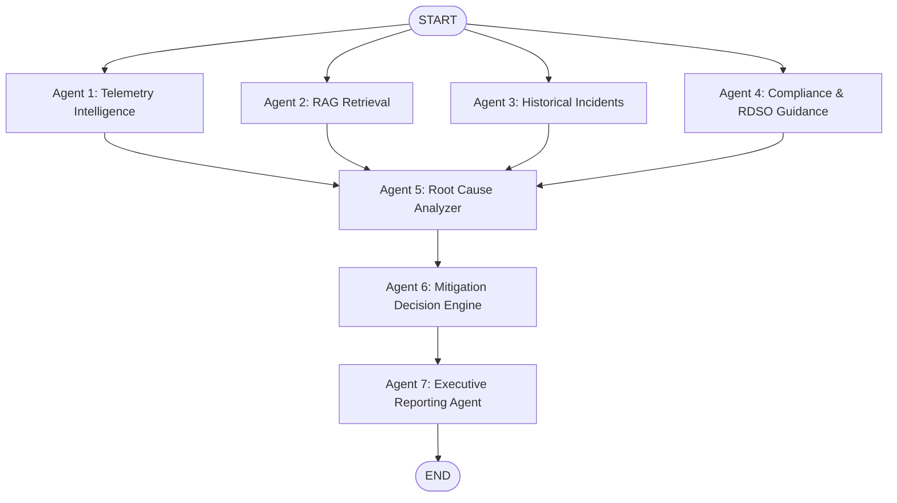

# Vanguard: AI-Powered Predictive Railway Maintenance & Real-Time Failure Simulation

Vanguard is an enterprise-grade, real-time predictive maintenance and safety mitigation platform designed for modern railway operations. By combining live IoT sensor telemetry streams, a multi-agent AI reasoning pipeline powered by **LangGraph**, and automated compliance verification against **RDSO (Research Designs and Standards Organisation)** guidelines, Vanguard detects anomalies, diagnoses root causes, and generates actionable mitigation strategies in seconds.

---

## 🛠 System Architecture



Vanguard employs a decoupled microservices-inspired architecture consisting of an interactive React dashboard, a Node.js API orchestrator, and a high-performance Python LangGraph reasoning engine running local Large Language Models (LLMs).



---

## 🤖 The 7-Agent LangGraph Reasoning Workflow

At the core of Vanguard's AI system is a deterministic, state-preserving multi-agent graph built using **LangGraph**. The workflow executes the following sequential and concurrent analysis passes to generate a complete diagnostic report:



1. **Telemetry Intelligence Agent (Agent 1)**: Evaluates live IoT sensor streams (temperature, track vibration, hazardous gas, overhead line voltage) against physical threshold bounds to detect immediate safety violations and compute base risk gradients.
2. **RAG Retrieval Agent (Agent 2)**: Queries the ChromaDB vector database to retrieve technical documentation regarding the targeted components.
3. **Historical Incident Agent (Agent 3)**: Performs statistical matching against historical CSV incident logs, identifying recurrence frequencies and previous component degradation trends.
4. **Compliance & RDSO Guidance Agent (Agent 4)**: Filters and extracts guidelines, inspection manuals, and procedural rules mandated by standard railway safety authorities (RDSO).
5. **Root Cause Analyzer (Agent 5)**: Synthesizes telemetry anomalies, prior history, standard compliant guides, and RAG context to isolate the exact mechanical/thermal root cause.
6. **Mitigation Decision Agent (Agent 6)**: Formulates an action plan categorizing corrective actions into priority timelines (Immediate, Weekly, Monthly, and Quarterly).
7. **Executive Reporting Agent (Agent 7)**: Aggregates all insights to construct the final system diagnostic payload, highlighting Risk Levels (Low, Medium, High, Critical), Escalation Channels, and urgent system alerts.

---

## 🌟 Key Features

* **Multi-Agent LangGraph Architecture**: Robust local AI analysis executing in under 90 seconds without dependencies on external SaaS APIs.
* **Thread-Safe Vector Store Integration**: Implements high-concurrency client pooling to prevent database locking during parallel retrieval passes.
* **Max Heap Incident Prioritization**: Real-time event prioritization indexing in MongoDB to escalate high-risk incidents to safety dashboards first.
* **Webhook & Notification System**: Integrates safety alerts with external channels (Slack, SMS, email) to trigger automated physical line shutdowns when critical hazards are flagged.
* **Sleek Glassmorphic Dashboard**: Real-time data visualization with dark-mode optimized graphs (Recharts), dynamic micro-animations (Framer Motion), and responsive industrial dashboards.
* **Advanced Compliance Logging**: Cryptographically verifiable audit trail detailing system state, operator actions, and risk recalculations.

---

## 💻 Tech Stack

| Layer | Technologies |
| :--- | :--- |
| **Frontend UI** | React.js, React Router, Socket.IO Client, Recharts, Framer Motion, CSS Design Tokens |
| **Backend Core** | Node.js, Express.js, Mongoose, Socket.IO, Child Process Runner |
| **Database** | MongoDB Atlas, Local Memory Caches |
| **AI Framework** | LangGraph, LangChain, ChromaDB Vector Store (v1.5.9) |
| **LLM Engine** | Ollama, Qwen2.5:3b (local inference), Nomic-Embed-Text (embeddings) |

---

## 🚀 Setup & Installation

### Prerequisites
* **Node.js** (v18 or higher)
* **Python** (v3.11.x)
* **MongoDB** (Atlas connection string or local instance)
* **Ollama** installed on your system

---

### Step 1: Install local LLM models
Start Ollama and pull the models required for inference and embedding generation:
```bash
ollama pull qwen2.5:3b
ollama pull nomic-embed-text
```

---

### Step 2: Set Up Python Virtual Environment
Navigate to the AI engine directory, create a virtual environment, and install dependencies:
```bash
cd ai
python -m venv venv
venv\Scripts\activate      # On Windows
source venv/bin/activate  # On macOS/Linux

pip install -r requirements.txt
```

#### Rebuilding the ChromaDB Vector database
If you need to seed the vector store with initial manuals and historical logs, run the vector builder script:
```bash
python scripts/build_vector_db.py
python scripts/expand_chromadb.py
```

---

### Step 3: Backend Setup
Open a new terminal session, navigate to the backend folder, configure environment variables, and start the server:
```bash
cd backend
npm install
```

Create a `.env` file in the `backend/` directory:
```env
PORT=5000
MONGO_URI=mongodb+srv://<user>:<password>@cluster0.mongodb.net/vanguard
JWT_SECRET=vanguard_super_secure_token_secret
NODE_ENV=development
```

Start the developer backend server:
```bash
npm run dev
```

---

### Step 4: Frontend Setup
Open another terminal session, navigate to the frontend folder, install dependencies, and launch the Vite dev server:
```bash
cd frontend
npm install
npm run dev
```

The web console will now be live at `http://localhost:3000`.

---

## 🔌 API Documentation (Key Endpoints)

### Simulation Endpoints

#### `POST /api/simulation/run`
Triggers the multi-agent diagnostic pipeline synchronously.
* **Payload**:
  ```json
  {
    "node": {
      "name": "Jaipur Signal Tower",
      "code": "ND0001",
      "type": "Signal"
    },
    "temperature": 135,
    "vibration": 85,
    "hazardousGas": 40,
    "voltage": 24,
    "riskScore": 90
  }
  ```
* **Response**: A complete JSON payload detailing retrieved sources, root cause, priority mitigation schedules, safety alerts, and risk level.

#### `POST /api/simulation/trigger`
Triggers the failure cascade asynchronously, pushing live progress logs down the Socket.IO pipeline.

#### `GET /api/simulation/history`
Retrieves a complete chronological log of all simulation attempts.

---

### Risk Assessment Endpoints

#### `POST /api/risk/calculate`
Re-evaluates and compiles live risk scores and threshold compliance flags for all railway network nodes.

---

## 🏆 Hackathon Pitch Summary

Vanguard bridges the gap between **industrial IoT telemetry** and **expert-level AI analysis**. In high-stakes railway management, decisions must be made in milliseconds:
* Instead of manual lookup of complex RDSO manuals, Vanguard retrieves and compiles them instantly using RAG.
* Instead of relying on single-metric heuristics, Vanguard aggregates metrics using a **7-agent LangGraph** engine to detect complex cascading failures.
* The system runs **100% locally on standard workstation GPUs/CPUs** using Ollama, showing extreme cost-efficiency and data privacy required for national infrastructure security.
