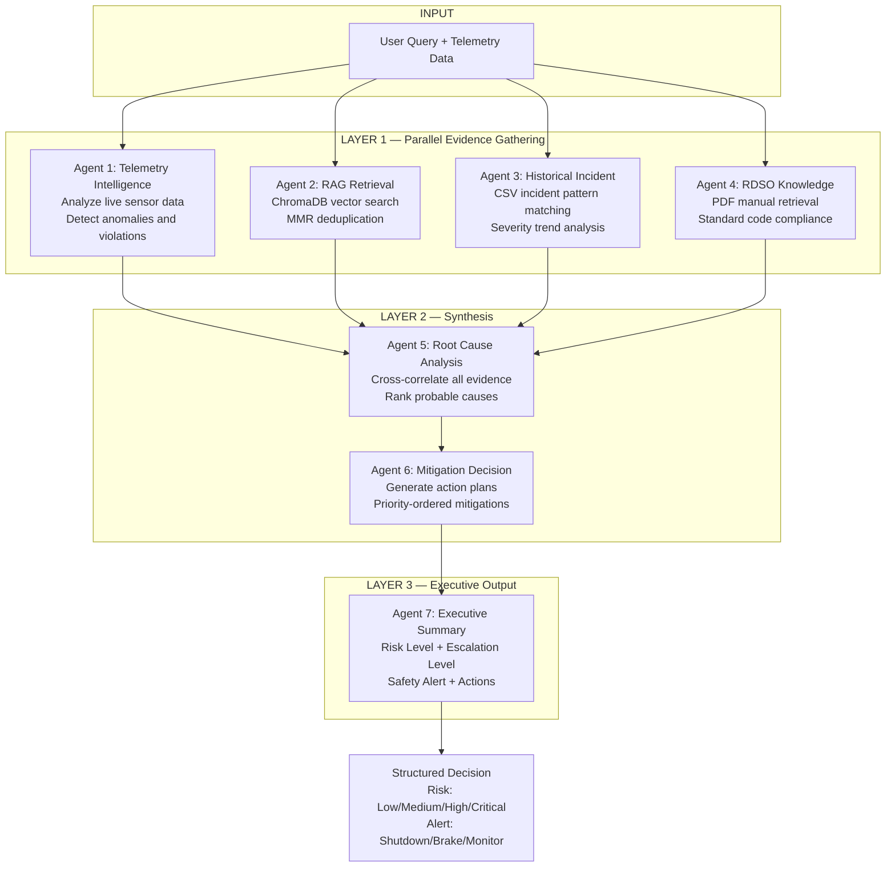
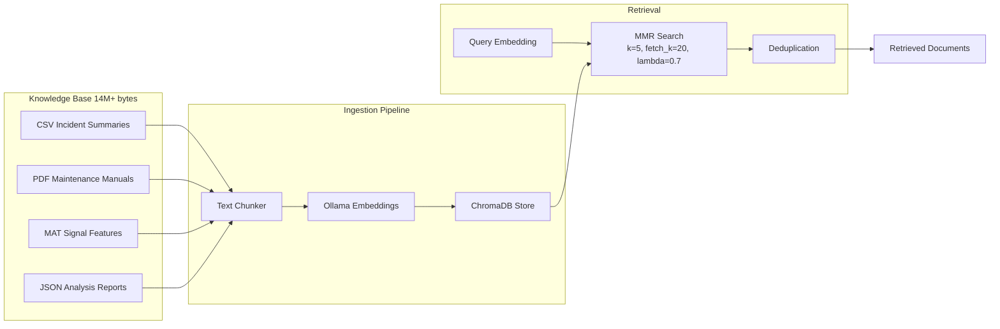
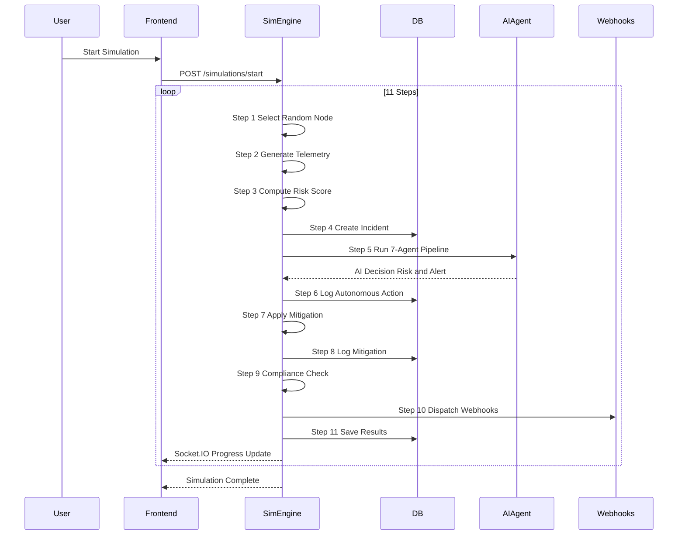
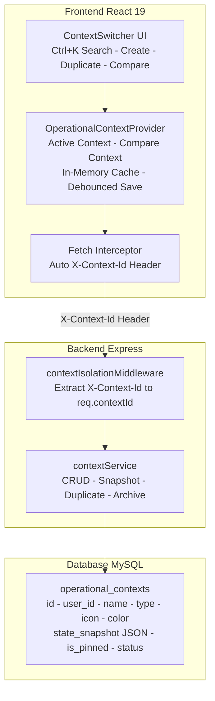
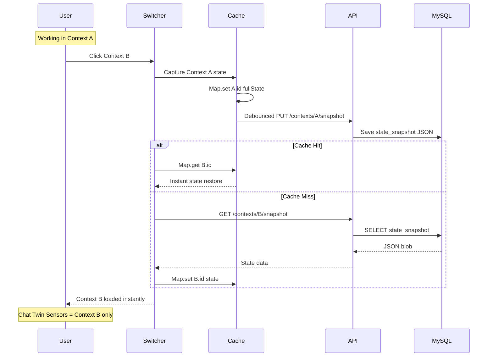

<div align="center">


<br/>

[](https://github.com/)

<br/>


<br/><br/>

```text
🔬 SENSE  →  🤖 ANALYZE (7 AI Agents)  →  🧠 DECIDE  →  ⚡ MITIGATE  →  📊 REPORT
```

</div>

---

> **Vanguard ARC** · Autonomous Railway Command — AI-Powered Predictive Maintenance Intelligence  
> **Architecture:** React 19 SPA + Node.js/Express API + Python LangGraph AI + MySQL 8.0 + Three.js Digital Twin  
> **Key Innovation:** Context Switching with Separation Logic — multiple operational scenarios run simultaneously with complete data and decision isolation  

Vanguard ARC is an enterprise-grade railway safety intelligence platform that fuses **real-time IoT telemetry**, a **7-agent LangGraph AI pipeline**, a **3D Digital Twin**, and **context-isolated operational workspaces** into a unified command center. It autonomously detects anomalies, diagnoses root causes against RDSO standards, generates mitigations, and executes safety actions — all while keeping multiple concurrent investigation contexts cleanly separated so their data and decisions never cross-contaminate.

<div align="center">

| 🤖 7-Agent AI Pipeline | 🔄 Context Switching | 🏗️ 3D Digital Twin | ⚡ Failure Simulation |
|:---:|:---:|:---:|:---:|
| LangGraph parallel agents | Full state isolation | Three.js + React Three Fiber | 11-step cascade engine |
| RAG + ChromaDB retrieval | Snapshot save/restore | Real-time train animation | Auto incident generation |
| RDSO compliance analysis | Duplicate & compare | Weather & environment | Risk score computation |
| Executive decision output | Per-context chat history | Live sensor overlays | Webhook dispatch |

</div>

### 📊 Project Presentation

**[📥 Download Vanguard AI Rail Presentation](./Vanguard_AI_Rail_part1.pptx)**

---

## Table of Contents

<details open>
<summary><b>Navigate</b></summary>

| # | Section | # | Section |
|---:|---|---:|---|
| 1 | [Overview](#1-overview) | 7 | [Context Switching — Separation Logic](#7-context-switching--separation-logic) |
| 2 | [Problem Statement](#2-problem-statement) | 8 | [Repository Structure](#8-repository-structure) |
| 3 | [Key Innovation — Context Switching](#3-key-innovation--context-switching) | 9 | [Authentication & Security](#9-authentication--security) |
| 4 | [Features & Deliverables](#4-features--deliverables) | 10 | [Setup (Local)](#10-setup-local) |
| 5 | [Technology Stack](#5-technology-stack) | 11 | [User Roles](#11-user-roles) |
| 6 | [7-Agent AI Pipeline — Architecture](#6-7-agent-ai-pipeline--architecture) | 12 | [Environment Variables](#12-environment-variables) |

</details>

---

## 1. Overview

**Vanguard ARC** (Autonomous Railway Command) is a full-stack, AI-native railway safety intelligence platform built for predictive maintenance, autonomous incident management, and real-time infrastructure monitoring across India's rail network. It manages the complete lifecycle of railway safety — from raw sensor ingestion to AI-driven executive decisions.

| Capability | What it does |
|---|---|
| **7-Agent LangGraph Pipeline** | Parallel multi-agent AI system (Telemetry Intelligence → RAG Retrieval → Historical Incident → RDSO Compliance → Root Cause → Mitigation → Executive Decision) powered by Ollama qwen2.5:3b and ChromaDB vector search. |
| **Context Switching — Separation Logic** | Multiple operational contexts (Train, Bridge, Station, Tunnel, Transformer) run simultaneously with fully isolated state — chat history, sensor readings, incidents, digital twin state, and AI decisions never leak between contexts. |
| **3D Digital Twin** | Real-time Three.js railway visualization with animated train models, weather systems, sensor overlays, and environment switching (Plains, Coastal, Desert, Mountain, Tunnel). |
| **Failure Simulation Engine** | 11-step autonomous cascade simulator that generates realistic failures, computes risk scores, creates incidents, executes the AI pipeline, applies mitigations, runs compliance checks, and dispatches webhooks. |
| **Max-Heap Priority Queue** | Custom DSA implementation for real-time incident prioritization using composite risk scores and severity weights with O(log n) insert/extract. |
| **Railway Network Visualization** | Interactive Leaflet map of 19 real Indian railway stations (Delhi → Mumbai corridor) with live status indicators, route segments, and connection health. |
| **Autonomous Agent** | Self-healing AI that monitors telemetry feeds, auto-generates incidents when thresholds breach, and executes predefined mitigation playbooks. |
| **Webhook Integration Center** | Event-driven webhook system with 14 event types, delivery tracking, retry logic, payload inspection, and real-time Socket.IO notifications. |
| **Executive Reporting** | Auto-generated compliance, incident, risk, and infrastructure reports exportable as PDF, CSV, and Excel. |
| **Role-Based Access Control** | Four roles (Admin, Operator, SafetyOfficer, Manager) with granular permissions, JWT authentication, OTP login, and admin user approval workflow. |

---

## 2. Problem Statement

### Predictive Railway Maintenance with Context-Isolated Operations

**Problem Abstract**  
Indian Railways operates one of the largest rail networks in the world with 68,000+ route kilometers, 7,000+ stations, and thousands of trains daily. Manual inspection and reactive maintenance leads to:
- **Delayed fault detection**: Sensor anomalies go unnoticed until equipment failure
- **Fragmented analysis**: Telemetry, historical incidents, and compliance standards are reviewed in isolation
- **Decision paralysis**: No unified system synthesizes all evidence into actionable mitigations
- **Context contamination**: When investigating multiple concurrent railway incidents, data and decisions from one investigation leak into another

**Context Switching: Separation Logic — The Core Innovation**

> Extend the MVP with a capability related to movement between tasks, items, modes, or work contexts. Specifically, keep multiple related cases separate so their data and decisions are not mixed together. The change should fit naturally into the existing MVP and remain independent of any specific hackathon theme.

Vanguard ARC addresses this by implementing **Operational Contexts** — isolated workspaces where each railway investigation maintains its own:
- Chat history with the AI agent
- Sensor telemetry snapshots
- Incident records
- Digital twin state (camera, weather, environment)
- Risk scores and mitigation decisions
- User notes

Switching between contexts is instantaneous (cached in-memory, debounce-persisted to MySQL) and guarantees **zero data leakage** between parallel investigations.

**Expected Outcomes**
- `→` Real-time anomaly detection across temperature, vibration, gas, and power telemetry
- `→` AI-synthesized root cause analysis combining 4 parallel evidence streams
- `→` RDSO-compliant mitigation recommendations with source citations
- `→` Context-isolated concurrent investigations with full state separation
- `→` Autonomous incident lifecycle management (create → investigate → mitigate → resolve)
- `→` 3D Digital Twin visualization with live sensor overlays
- `→` Failure cascade simulation with end-to-end automation
- `→` Max-Heap priority queue for dynamic incident prioritization
- `→` Event-driven webhook integration for external system alerts
- `→` Executive reporting with multi-format export

**Evaluation Criteria Mapping**

| Criteria | Implementation in Vanguard ARC |
|:---|:---|
| **Understanding of Problem** | Directly targets the gap between reactive railway maintenance and AI-powered predictive intelligence, with context isolation ensuring parallel investigations remain independent. |
| **Proposed Approach** | React 19 + Node.js/Express + Python LangGraph multi-agent AI + MySQL 8.0 + Three.js Digital Twin + ChromaDB RAG + Socket.IO real-time. |
| **Context Switching** | Full implementation of Separation Logic — Operational Contexts with isolated state snapshots, in-memory caching, debounced persistence, X-Context-Id header injection, and duplicate/compare workflows. |
| **DSA Implementation** | Max-Heap Priority Queue for incident prioritization with composite scoring (riskScore primary, severityWeight secondary). |
| **AI/ML Integration** | 7-agent LangGraph pipeline with parallel execution, RAG retrieval (ChromaDB + Ollama embeddings), and structured executive decision output. |

---

## 3. Key Innovation — Context Switching

<div align="center">

```text
┌─────────────────────────────────────────────────────────────┐
│                    CONTEXT SWITCHER (Ctrl+K)                │
├──────────────┬──────────────┬──────────────┬───────────────┤
│  🚂 Train    │  🌉 Bridge   │  🏗️ Station  │  🔌 Custom    │
│  Delhi-Mum   │  Yamuna Seg  │  Jaipur Jn   │  Investigation│
│  ● Active    │  ○ Cached    │  ○ Cached    │  ○ New        │
└──────────────┴──────────────┴──────────────┴───────────────┘
         │              │              │
         ▼              ▼              ▼
   ┌───────────┐  ┌───────────┐  ┌───────────┐
   │ State A   │  │ State B   │  │ State C   │
   │ Chat: 12  │  │ Chat: 5   │  │ Chat: 0   │
   │ Risk: 78  │  │ Risk: 34  │  │ Risk: —   │
   │ Env: Plns │  │ Env: Cstl │  │ Env: Plns │
   │ Twin: ✓   │  │ Twin: ✓   │  │ Twin: ✓   │
   └───────────┘  └───────────┘  └───────────┘
        ▲ ISOLATED      ▲ ISOLATED      ▲ ISOLATED
```

</div>

### How Separation Logic Works

| Layer | Implementation | File |
|---|---|---|
| **Frontend Context Provider** | `OperationalContextProvider` wraps the entire app, manages active/compare contexts, in-memory Map cache, debounced save | `OperationalContext.jsx` |
| **Context Switcher UI** | Searchable dropdown (Ctrl+K), create/duplicate/archive/compare, per-context color & icon | `ContextSwitcher.jsx` |
| **Backend Middleware** | `contextIsolationMiddleware` extracts `X-Context-Id` header on every API request, attaches to `req.contextId` | `contextIsolationMiddleware.js` |
| **Backend Service** | Full CRUD + snapshot save/restore + duplicate with deep-clone + user-scoped security | `contextService.js` |
| **Database** | `operational_contexts` table with JSON `state_snapshot` column for serialized ephemeral state | `contextMigration.sql` |
| **Header Injection** | Frontend intercepts `window.fetch` to automatically add `X-Context-Id` header to all `/api` requests | `OperationalContext.jsx` |

### Isolation Guarantees

1. **Chat Messages**: Each context has its own AI conversation history — switching contexts loads a completely different chat thread
2. **Digital Twin State**: Camera position, weather mode, environment, active emergencies are all per-context
3. **Sensor Configuration**: Telemetry environment presets are context-bound
4. **Incident Records**: Context ID is attached to incident queries for scoped retrieval
5. **State Persistence**: Snapshots are debounced (2s) to MySQL, with immediate in-memory cache updates for instant switching
6. **Compare Mode**: Load two contexts side-by-side without merging their data

---

## 4. Features & Deliverables

### Core Features

| # | Feature | Status | Module |
|---:|---|:---:|---|
| 01 | 7-Agent LangGraph AI Pipeline | ✅ | `ai/agents/nodes.py`, `ai/scripts/graph.py` |
| 02 | Context Switching — Separation Logic | ✅ | `OperationalContext.jsx`, `contextService.js` |
| 03 | 3D Digital Twin (Three.js + R3F) | ✅ | `Train3DModel.jsx`, `EnvironmentAssets.jsx` |
| 04 | Failure Simulation Engine (11-Step) | ✅ | `simulationEngine.js`, `FailureSimulation.jsx` |
| 05 | Max-Heap Incident Priority Queue | ✅ | `maxHeap.js`, `incidentPriorityService.js` |
| 06 | Railway Network Map (Leaflet) | ✅ | `RailwayNetwork.jsx` |
| 07 | Autonomous Agent (Self-Healing AI) | ✅ | `AutonomousAgent.jsx`, `aiAgentService.js` |
| 08 | Webhook Integration Center | ✅ | `WebhookCenter.jsx`, `webhookService.js` |
| 09 | Executive Reporting (PDF/CSV/Excel) | ✅ | `Reports.jsx`, `reportService.js` |
| 10 | Incident Management Lifecycle | ✅ | `IncidentManagement.jsx`, `incidentService.js` |
| 11 | Risk Analysis Engine | ✅ | `RiskAnalysis.jsx`, `riskService.js` |
| 12 | Compliance Center (RDSO/API617/IEC) | ✅ | `ComplianceCenter.jsx`, `complianceService.js` |
| 13 | Mitigation Center | ✅ | `MitigationCenter.jsx`, `mitigationService.js` |
| 14 | Telemetry Center | ✅ | `TelemetryCenter.jsx`, `sensorService.js` |
| 15 | Command Center (AI Chat + Digital Twin) | ✅ | `CommandCenter.jsx` |
| 16 | Role-Based Dashboards (4 Roles) | ✅ | `AdminDashboard.jsx`, `OperatorDashboard.jsx`, etc. |
| 17 | JWT Authentication + OTP Login | ✅ | `authController.js`, `authMiddleware.js` |
| 18 | Admin User Approval Workflow | ✅ | `UserApprovalsPage.jsx` |
| 19 | Notification System (Socket.IO) | ✅ | `notificationService.js` |
| 20 | Audit Logging with IP Tracking | ✅ | `auditService.js`, `AuditLogs.jsx` |
| 21 | Infrastructure Database | ✅ | `InfrastructureDatabase.jsx` |
| 22 | Settings & Profile Management | ✅ | `Settings.jsx` |

### DSA & Algorithm Implementations

| # | Algorithm | Purpose | File |
|---:|---|---|---|
| 01 | **Max-Heap Priority Queue** | O(log n) incident prioritization with composite risk+severity scoring | `maxHeap.js` |
| 02 | **Graph Traversal (Network Topology)** | Railway node/connection graph with adjacency list representation | `routeService.js` |
| 03 | **MMR (Maximal Marginal Relevance)** | Diversity-optimized document retrieval in RAG pipeline | `nodes.py` |
| 04 | **Debounced State Persistence** | Efficient context snapshot saves with 2s debounce timer | `OperationalContext.jsx` |
| 05 | **In-Memory Map Cache** | O(1) context state lookup for instant switching | `OperationalContext.jsx` |

---

## 5. Technology Stack

<div align="center">

</div>

<br/>

<div align="center">


</div>

<br/>

| Layer | Technology | Purpose |
|---|---|---|
| **Frontend** | React 19 + Vite 8 | SPA with component architecture, Framer Motion animations |
| **3D Engine** | Three.js + React Three Fiber + Drei | Digital twin visualization with GLB models, post-processing |
| **Charts** | Recharts | Data visualization for dashboards, risk analysis, reports |
| **Maps** | Leaflet + MarkerCluster | Railway network topology visualization |
| **State** | React Context API | Operational context management with isolation |
| **Routing** | React Router v7 | Client-side routing with protected routes |
| **Styling** | Vanilla CSS + Design Tokens | Enterprise design system with CSS custom properties |
| **Backend** | Node.js + Express 4 | REST API with MVC architecture (Controller → Service → Repository) |
| **Database** | MySQL 8.0 (mysql2) | 15+ tables — users, railway_nodes, incidents, simulations, contexts, etc. |
| **AI Engine** | Python + LangGraph + LangChain | 7-agent parallel/sequential workflow orchestration |
| **LLM** | Ollama (qwen2.5:3b) | Local LLM inference for all agent nodes |
| **Vector DB** | ChromaDB + Ollama Embeddings | RAG retrieval with MMR search (k=5, fetch_k=20, lambda=0.7) |
| **Knowledge Base** | JSON + CSV incident summaries | 14M+ bytes of railway maintenance knowledge |
| **Auth** | JWT + bcrypt | Token-based authentication with role-based access |
| **Real-Time** | Socket.IO | Live notifications, webhook events, simulation progress |
| **Reports** | PDFKit + ExcelJS + json2csv | Multi-format report generation |
| **Email** | Nodemailer (Gmail SMTP) | OTP delivery, notifications |
| **Validation** | Joi + Zod | Backend (Joi) and frontend (Zod) schema validation |

---

## 6. 7-Agent AI Pipeline — Architecture

The heart of Vanguard ARC is a **LangGraph multi-agent workflow** that processes every railway safety query through 7 specialized AI agents. Four agents execute in parallel (Layer 1), feeding into a sequential synthesis chain (Layer 2-3).

### 6.1 Agent Pipeline Architecture


```mermaid
graph TD
    subgraph "INPUT"
        Q[User Query + Telemetry Data]
    end

    subgraph "LAYER 1 — Parallel Evidence Gathering"
        A1["Agent 1: Telemetry Intelligence\nAnalyze live sensor data\nDetect anomalies and violations"]
        A2["Agent 2: RAG Retrieval\nChromaDB vector search\nMMR deduplication"]
        A3["Agent 3: Historical Incident\nCSV incident pattern matching\nSeverity trend analysis"]
        A4["Agent 4: RDSO Knowledge\nPDF manual retrieval\nStandard code compliance"]
    end

    subgraph "LAYER 2 — Synthesis"
        A5["Agent 5: Root Cause Analysis\nCross-correlate all evidence\nRank probable causes"]
        A6["Agent 6: Mitigation Decision\nGenerate action plans\nPriority-ordered mitigations"]
    end

    subgraph "LAYER 3 — Executive Output"
        A7["Agent 7: Executive Summary\nRisk Level + Escalation Level\nSafety Alert + Actions"]
    end

    Q --> A1
    Q --> A2
    Q --> A3
    Q --> A4

    A1 --> A5
    A2 --> A5
    A3 --> A5
    A4 --> A5

    A5 --> A6
    A6 --> A7
    A7 --> OUTPUT["Structured Decision\nRisk: Low/Medium/High/Critical\nAlert: Shutdown/Brake/Monitor"]
```

### 6.2 Agent Details

| # | Agent | Input | Output | RAG Filter |
|---:|---|---|---|---|
| 1 | **Telemetry Intelligence** | Live sensor readings (temp, vibration, gas, power) | Threat classification, risk level, trend diagnosis | — |
| 2 | **RAG Retrieval** | User query | Deduplicated context documents, source names | General (all) |
| 3 | **Historical Incident** | User query | Incident patterns, severity trends, recurring findings | `source_type: csv_incident` |
| 4 | **RDSO Knowledge** | User query | Standard codes, inspection intervals, compliance rules | `dataset: pdf_manuals` |
| 5 | **Root Cause** | All Layer 1 outputs | Ranked root causes with supporting evidence | — |
| 6 | **Mitigation Decision** | Root causes + all evidence | Prioritized inspection and maintenance actions | — |
| 7 | **Executive Summary** | All upstream outputs | Risk Level, Escalation Level, Safety Alert, Actions | — |

### 6.3 RAG Pipeline Detail


```mermaid
flowchart LR
    subgraph "Knowledge Base 14M+ bytes"
        KB1[CSV Incident Summaries]
        KB2[PDF Maintenance Manuals]
        KB3[MAT Signal Features]
        KB4[JSON Analysis Reports]
    end

    subgraph "Ingestion Pipeline"
        CH[Text Chunker]
        EM[Ollama Embeddings]
        CR[ChromaDB Store]
    end

    subgraph "Retrieval"
        QE[Query Embedding]
        MMR["MMR Search\nk=5, fetch_k=20, lambda=0.7"]
        DD[Deduplication]
    end

    KB1 --> CH
    KB2 --> CH
    KB3 --> CH
    KB4 --> CH
    CH --> EM
    EM --> CR

    QE --> MMR
    CR --> MMR
    MMR --> DD
    DD --> DOCS[Retrieved Documents]
```

### 6.4 Failure Simulation Pipeline


```mermaid
sequenceDiagram
    participant User
    participant Frontend
    participant SimEngine
    participant DB
    participant AIAgent
    participant Webhooks

    User->>Frontend: Start Simulation
    Frontend->>SimEngine: POST /simulations/start

    loop 11 Steps
        SimEngine->>SimEngine: Step 1 Select Random Node
        SimEngine->>SimEngine: Step 2 Generate Telemetry
        SimEngine->>SimEngine: Step 3 Compute Risk Score
        SimEngine->>DB: Step 4 Create Incident
        SimEngine->>AIAgent: Step 5 Run 7-Agent Pipeline
        AIAgent-->>SimEngine: AI Decision Risk and Alert
        SimEngine->>DB: Step 6 Log Autonomous Action
        SimEngine->>SimEngine: Step 7 Apply Mitigation
        SimEngine->>DB: Step 8 Log Mitigation
        SimEngine->>SimEngine: Step 9 Compliance Check
        SimEngine->>Webhooks: Step 10 Dispatch Webhooks
        SimEngine->>DB: Step 11 Save Results
        SimEngine-->>Frontend: Socket.IO Progress Update
    end

    SimEngine-->>Frontend: Simulation Complete
```

---

## 7. Context Switching — Separation Logic

### 7.1 Architecture Overview


```mermaid
graph TD
    subgraph "Frontend React 19"
        CS["ContextSwitcher UI\nCtrl+K Search - Create - Duplicate - Compare"]
        OC["OperationalContextProvider\nActive Context - Compare Context\nIn-Memory Cache - Debounced Save"]
        FI["Fetch Interceptor\nAuto X-Context-Id Header"]
    end

    subgraph "Backend Express"
        CIM["contextIsolationMiddleware\nExtract X-Context-Id to req.contextId"]
        CSR["contextService\nCRUD - Snapshot - Duplicate - Archive"]
    end

    subgraph "Database MySQL"
        OCT["operational_contexts\nid - user_id - name - type - icon - color\nstate_snapshot JSON - is_pinned - status"]
    end

    CS --> OC
    OC --> FI
    FI -->|X-Context-Id Header| CIM
    CIM --> CSR
    CSR --> OCT
```

### 7.2 State Isolation Flow


```mermaid
sequenceDiagram
    participant User
    participant Switcher
    participant Cache
    participant API
    participant MySQL

    Note over User: Working in Context A

    User->>Switcher: Click Context B
    Switcher->>Cache: Capture Context A state
    Cache->>Cache: Map.set A.id fullState
    Cache->>API: Debounced PUT /contexts/A/snapshot
    API->>MySQL: Save state_snapshot JSON

    alt Cache Hit
        Switcher->>Cache: Map.get B.id
        Cache-->>Switcher: Instant state restore
    else Cache Miss
        Switcher->>API: GET /contexts/B/snapshot
        API->>MySQL: SELECT state_snapshot
        MySQL-->>API: JSON blob
        API-->>Switcher: State data
        Switcher->>Cache: Map.set B.id state
    end

    Switcher-->>User: Context B loaded instantly
    Note over User: Chat Twin Sensors = Context B only
```

### 7.3 What Gets Isolated

| Data | Storage | Isolation Level |
|---|---|---|
| AI Chat Messages | `state_snapshot.chatMessages[]` | Full — each context has its own conversation |
| Digital Twin State | `state_snapshot.twin{}` | Full — camera, weather, environment, emergencies |
| Sensor Configuration | `state_snapshot.sensorConfig{}` | Full — environment presets per context |
| Right Drawer State | `state_snapshot.rightDrawerTab` | Full — UI state preserved |
| User Notes | `state_snapshot.userNotes` | Full — per-context scratchpad |
| Incidents | Queried with `X-Context-Id` | Scoped — API-level filtering |

---

## 8. Repository Structure

```text
Vanguard/
├── README.md
│
├── ai/                                    # Python AI Engine
│   ├── agents/
│   │   ├── nodes.py                       # 7 agent node functions (458 LOC)
│   │   ├── state.py                       # VanguardState TypedDict
│   │   └── reporting.py                   # Executive report file output
│   ├── scripts/
│   │   ├── graph.py                       # LangGraph workflow builder
│   │   ├── run_agents.py                  # CLI entry point
│   │   ├── rag_chain.py                   # RAG pipeline (ChromaDB + retriever)
│   │   ├── build_vector_db.py             # ChromaDB index builder
│   │   ├── generate_csv_incidents.py      # CSV incident summary generator
│   │   ├── extract_mat_features.py        # MAT signal feature extractor
│   │   └── json_stream.py                 # JSON knowledge base processor
│   ├── knowledge_base/                    # RAG knowledge corpus (14M+ bytes)
│   └── chroma_db/                         # ChromaDB vector store
│
├── backend/                               # Node.js Express API
│   ├── src/
│   │   ├── server.js                      # Express + Socket.IO entry
│   │   ├── app.js                         # Express configuration
│   │   ├── middleware/
│   │   │   ├── authMiddleware.js           # JWT verification
│   │   │   ├── contextIsolationMiddleware.js # X-Context-Id extraction
│   │   │   ├── roleMiddleware.js           # Role-based authorization
│   │   │   ├── rateLimiter.js              # Rate limiting
│   │   │   ├── errorHandler.js             # Global error handler
│   │   │   └── validateMiddleware.js       # Joi validation
│   │   ├── routes/                        # 17 route modules
│   │   ├── controllers/                   # 19 controllers
│   │   ├── services/                      # 16 services + MaxHeap DSA
│   │   │   ├── contextService.js           # Context isolation (348 LOC)
│   │   │   ├── simulationEngine.js         # 11-step simulator (827 LOC)
│   │   │   ├── maxHeap.js                  # Max-Heap priority queue (208 LOC)
│   │   │   ├── incidentPriorityService.js  # Heap-based prioritization
│   │   │   ├── aiAgentService.js           # Autonomous agent logic
│   │   │   └── webhookService.js           # Event-driven webhooks
│   │   ├── repositories/                  # 14 data access layers
│   │   ├── database/
│   │   │   ├── schema.sql                  # Full MySQL schema (537 LOC)
│   │   │   ├── contextMigration.sql        # Context tables
│   │   │   └── seed.js                     # Data seeder
│   │   └── utils/                         # pythonRunner, auditLogger
│   └── stations_7300.json                 # Real Indian station data
│
├── frontend/                              # React 19 SPA
│   ├── src/
│   │   ├── App.jsx                        # Root app with routing
│   │   ├── contexts/
│   │   │   ├── OperationalContext.jsx      # Context switching (257 LOC)
│   │   │   ├── AuthContext.jsx             # JWT auth state
│   │   │   ├── SimulationContext.jsx       # Simulation state
│   │   │   └── ThemeContext.jsx            # Dark theme
│   │   ├── components/
│   │   │   ├── layout/                    # AppShell, Navbar, Sidebar
│   │   │   └── modules/
│   │   │       ├── ContextSwitcher.jsx     # Context switching UI (193 LOC)
│   │   │       ├── Train3DModel.jsx        # 3D train visualization
│   │   │       └── digital-twin/           # 13 Digital Twin components
│   │   ├── pages/
│   │   │   ├── modules/                   # 13 module pages
│   │   │   ├── dashboards/                # 4 role-based dashboards
│   │   │   ├── public/                    # 11 public pages
│   │   │   └── settings/                  # User settings
│   │   └── styles/                        # CSS design system
│   └── package.json
│
├── docs/                                  # Documentation
└── *.glb                                  # 10 Indian railway 3D models
```

---

## 9. Authentication & Security

| Feature | Implementation |
|---|---|
| **Signup** | Name, email, password, role selection (Admin/Operator/SafetyOfficer/Manager) |
| **Login** | Email + password → JWT token with role-based dashboard redirect |
| **OTP Login** | 6-digit OTP via Nodemailer (Gmail SMTP) with lockout after failed attempts |
| **JWT Tokens** | jsonwebtoken with configurable expiry, verified by authMiddleware |
| **Password Hashing** | bcrypt with salt rounds |
| **Admin Approval** | New user accounts require admin activation before first login |
| **Role-Based Access** | authorizeRoles() middleware restricts endpoints to specific roles |
| **Context Isolation** | contextIsolationMiddleware ensures requests are scoped to active context |
| **Rate Limiting** | Custom rate limiter middleware for auth endpoints |
| **Input Validation** | Joi schemas on backend, Zod schemas on frontend |
| **Audit Logging** | Full action trail with IP address, module, timestamp tracking |

---

## 10. Setup (Local)

### Prerequisites

- Node.js 18+
- Python 3.10+
- MySQL 8.0+
- Ollama (for AI features)

### 1. Clone the Repository

```bash
git clone https://github.com/your-username/vanguard-arc.git
cd vanguard-arc
```

### 2. Database Setup

```sql
CREATE DATABASE vanguard CHARACTER SET utf8mb4 COLLATE utf8mb4_unicode_ci;
```

### 3. Backend Setup

```bash
cd backend
npm install
cp .env.example .env
# Edit .env with MySQL credentials, JWT secret, etc.

# Run migrations
mysql -u root -p vanguard < src/database/schema.sql
mysql -u root -p vanguard < src/database/contextMigration.sql

# Seed data
node src/database/seed.js

# Start backend
npm run dev
```

### 4. Frontend Setup

```bash
cd frontend
npm install
npm run dev
```

Visit: `http://localhost:3001`

### 5. AI Engine Setup

```bash
# Install Ollama (https://ollama.ai)
ollama pull qwen2.5:3b

cd ai/scripts
pip install langchain langchain-ollama langchain-chroma chromadb

# Build vector database
python build_vector_db.py

# Test pipeline
python run_agents.py --query "Bearing temperature anomaly at Jaipur" --telemetry '{"temperature": 85, "vibration": 6.2}'
```

---

## 11. User Roles

<div align="center">

| Role | Dashboard | Key Capabilities |
|:---:|:---:|---|
| 🛡️ **Admin** | `/admin-dashboard` | User approvals, system management, audit logs, compliance oversight |
| 🔧 **Operator** | `/operator-dashboard` | Command center, digital twin control, incident management, AI chat |
| ⚠️ **SafetyOfficer** | `/safety-dashboard` | Risk analysis, compliance monitoring, mitigation approvals |
| 📊 **Manager** | `/manager-dashboard` | Executive reports, infrastructure overview, performance metrics |

</div>

---

## 12. Environment Variables

| Variable | Description | Example |
|---|---|---|
| `PORT` | Backend server port | `5000` |
| `DB_HOST` | MySQL host | `localhost` |
| `DB_USER` | MySQL username | `root` |
| `DB_PASSWORD` | MySQL password | `your_password` |
| `DB_NAME` | MySQL database name | `vanguard` |
| `JWT_SECRET` | JWT signing secret | `your-secret-key` |
| `JWT_EXPIRE` | Token expiry | `24h` |
| `EMAIL_USER` | Gmail for SMTP | `you@gmail.com` |
| `EMAIL_PASS` | Gmail App Password | `xxxx xxxx xxxx xxxx` |
| `VANGUARD_TEST` | Mock AI responses | `false` |
| `FRONTEND_URL` | Frontend origin for CORS | `http://localhost:3001` |

---

<div align="center">


<br/>

<i>Built with 🔷 by the Vanguard ARC Team</i>

<br/><br/>


</div>
